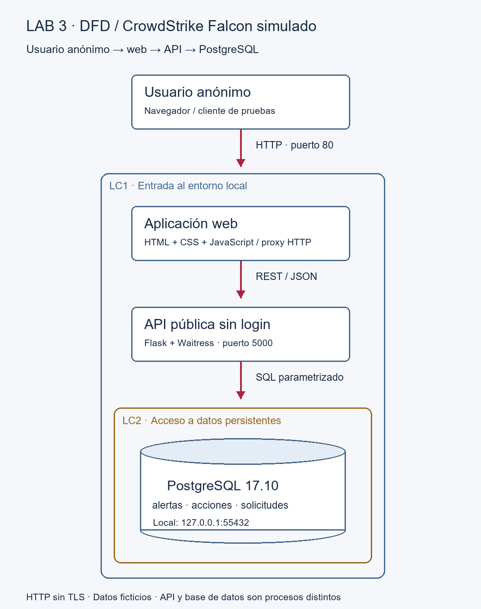

# Entrega local — Laboratorio 3

**Estudiantes:** Juan Sebstian Murcia Yanquen y Sara Viviana Arteaga Rodriguez
**Tema:** Opción 1 — Automatización de incidentes de CrowdStrike Falcon.
**Modalidad:** prototipo local con información ficticia, HTTP y acceso anónimo.

## 1. Requisitos y problemática (perspectiva de negocio)

La recepción, clasificación, enriquecimiento y escalamiento manual de alertas aumenta
los tiempos de respuesta y puede generar criterios diferentes al priorizar incidentes.
El objetivo de esta entrega es centralizar alertas ficticias, permitir su consulta por
API y conservar las acciones realizadas. No sustituye un sistema SOC productivo.

| ID | Requisito | Implementación / criterio de aceptación |
|---|---|---|
| RF1 | Recibir alertas ficticias | Formulario y POST /api/alertas; respuesta 201 |
| RF2 | Consultar lista y detalle | Bandeja, filtro de severidad y GET por ID |
| RF3 | Clasificar | Cambio manual de severidad registrado en acciones |
| RF4 | Enriquecer | Añadir una nota ficticia al historial |
| RF5 | Escalar | Cambio de estado a escalada, sin enviar información a terceros |
| RF6 | Registrar acciones | Transacción PostgreSQL con actor anónimo, fecha y request_id |
| RNF1 | Seguir arquitectura docente | Usuario → HTTP → web → REST → API → PostgreSQL |
| RNF2 | Persistencia | Los registros sobreviven a un proceso API nuevo |
| RNF3 | Datos ficticios | Sin credenciales ni conexión real a CrowdStrike |
| RNF4 | Alcance local | Puertos ligados a 127.0.0.1; no publicación en Internet |

## 2. DFD (perspectivas adversario y defensor)

La aplicación web recibe al usuario anónimo por HTTP en el puerto 80. Su interfaz
consume rutas REST `/api/…`; el servidor web las envía a la API independiente del
puerto 5000. La API consulta PostgreSQL en 55432 usando credenciales de servidor.

**LC1: usuario/red → aplicación web.** Las entradas del navegador no son confiables.
En local la escucha está limitada a loopback. Si se despliega, debe limitarse al
segmento autorizado. El origen anónimo continúa siendo un riesgo deliberado.

**LC2: API → PostgreSQL.** Se cruza de peticiones públicas a datos persistentes. La API
valida campos y utiliza consultas parametrizadas. El navegador no recibe credenciales
de PostgreSQL. El iniciador local crea un usuario de aplicación sin superusuario.

Los tres almacenes son `alertas`, `acciones` y `solicitudes`. Las acciones y los cambios
de alerta se guardan en una misma transacción; las solicitudes HTTP se registran con
hora, método, ruta, código y un identificador de correlación.

## 3. Amenazas, vulnerabilidades y riesgos (perspectiva adversario)

| ID | STRIDE | Hipótesis | Estado de evidencia local |
|---|---|---|---|
| H1 | Information Disclosure | HTTP no cifra títulos, equipos ni respuestas | HTTP usado; no se realizó PCAP |
| H2 | Information Disclosure | Un usuario anónimo consulta alertas y acciones | Consulta anónima comprobada |
| H3 | Repudiation | Un registro con IP/hora no demuestra identidad del actor | Actor anónimo; correlación request_id comprobada |
| H4 | Tampering | Un usuario anónimo puede crear alertas y cambiar estados | POST y acciones anónimas comprobados |
| H5 | Tampering | Entradas no confiables podrían alterar consultas o interfaz | SQL parametrizado y textContent inspeccionados; no se declara un pentest completo |

La [matriz de riesgos](risk-register.md) distingue los riesgos abiertos de los controles
aplicados. No se presentan observaciones de diseño como explotación demostrada.

## 4. Controles y mitigaciones (perspectiva defensor)

| Control | Implementación | Límite |
|---|---|---|
| Validación de campos | Tipos, longitudes y severidades permitidas; JSON máximo 8192 bytes | No autentica al remitente |
| Consultas parametrizadas | Valores pasados como parámetros psycopg | No equivale a una evaluación DAST completa |
| Salida segura en web | Datos renderizados con textContent; CSP sin scripts externos | Requiere mantener ese patrón en futuras funciones |
| Cabeceras | nosniff, DENY, no-referrer; Cache-Control no-store | No cifra HTTP |
| Archivos permitidos | Web solo sirve index, CSS, JS e inventario ficticio; /.env devuelve 404 | API y datos siguen disponibles anónimamente |
| Separación de credenciales | Secretos locales fuera de Git; rol PostgreSQL sin superusuario en Windows | La copia Docker necesita endurecer roles antes de producción |
| Trazabilidad | request_id, UTC y tablas de acciones y solicitudes | No hay identidad; administrador de BD puede alterar registros |
| Restricción de red local | Servicios ligados a loopback | No valida un firewall de nube ni una red entre equipos |

### Detección reproducible

`deteccion.sql` agrupa respuestas 404 de una misma IP en los últimos cinco minutos y
devuelve las que tienen al menos cinco eventos. Se evaluó con cinco solicitudes locales.
La aplicación web actúa como proxy: la API ve la IP del proxy, no necesariamente la del
usuario final. Para una ronda entre equipos se deben correlacionar también los logs de
acceso del servidor web. Enlaces rotos, pruebas legítimas o usuarios detrás de un mismo
proxy pueden generar falsos positivos. No se implementa bloqueo automático.

## 5. Pruebas y comparación antes/después

La evidencia reproducible está en [evidencia-local.json](evidencia-local.json), generada
por [verificar.py](verificar.py). Se ejecutaron 23 comprobaciones locales satisfactorias:
web HTTP, conexión PostgreSQL, recepción y consulta anónimas, cuatro tipos de acción,
persistencia, correlación, validación, 404 controlados y cabeceras.

Para el retest se levantó una API auxiliar en loopback:5001 con `HARDENING=0`, se
consultaron sus cabeceras, se detuvo el proceso y se levantó de nuevo con `HARDENING=1`.
La nueva instancia conservó el registro en PostgreSQL y añadió las cabeceras previstas.
La web principal permaneció con controles activados durante la prueba.

| Aspecto | Antes | Después |
|---|---|---|
| X-Frame-Options / nosniff en API auxiliar | Ausentes en línea base | DENY / nosniff verificados |
| Proceso API auxiliar | Detenido después de la consulta inicial | Nueva instancia recupera alerta y acciones |
| Datos de la primera versión del proyecto | Almacenamiento en memoria | PostgreSQL persistente en la versión actual |
| Inventario público ficticio | `6abaf20` incluía funciones de cada componente | La versión actual conserva solo tres identificadores ficticios; comparación en Git |
| HTTP e identidad | Sin cifrado ni autenticación | Siguen abiertos por alcance pedagógico |

No se ejecutaron Nmap, ZAP, PCAP, un ataque MITM, pruebas destructivas ni pruebas contra
servicios externos. Tampoco se ejecutó Docker/Nginx en este equipo. Sus configuraciones
son material de reproducción y no evidencia de ejecución.

## 6. Resultado y límites de la entrega

El prototipo local cumple la arquitectura y permite recorrer recepción, consulta,
clasificación, notas, escalamiento simulado y registro persistente. Los riesgos más
importantes que quedan abiertos son acceso anónimo, confidencialidad de HTTP e identidad
insuficiente para atribuir acciones. Se tratarán con HTTPS, autenticación y roles en
el laboratorio 4, según la guía.

La entrega cubre la implementación local y los cuatro puntos de la foto. Para acreditar
el laboratorio completo de tres horas todavía se requieren las actividades Red/Blue
del alcance docente que no se ejecutaron aquí, y la reflexión individual del estudiante.
No se asigna `lab-3` a una supuesta ejecución completa que no ocurrió.

## 7. Uso de IA y defensa oral

Código y documentación preparados con asistencia de Codex. Las pruebas se atribuyen
a la verificación automatizada local, no a experiencias del estudiante. Solo se usaron
datos ficticios y no se compartieron secretos ni PCAP reales.

Para explicarlo: el navegador maneja la interfaz; la web envía JSON por REST; la API
valida y ejecuta SQL parametrizado; PostgreSQL conserva alertas e historial. Un registro
de actividad ayuda a investigar, pero no prueba quién actuó si todos entran anónimamente.

La reflexión individual (máximo 250 palabras) debe escribirse después de ejecutar la
demostración propia. No se sustituye por una experiencia personal inventada.
