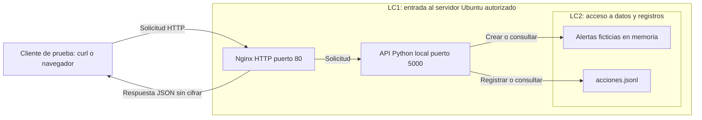

# Lab 3 — Automatización de incidentes de CrowdStrike Falcon

**Estudiante:** Juan Sebstian Murcia Yanquen.

**Opción 1 · Entrega inicial de una hora · Solo datos ficticios.**

## Problema y objetivo

La recepción, clasificación, enriquecimiento y escalamiento manual de alertas puede
demorar la respuesta y generar criterios diferentes de priorización. Como primer
paso, este prototipo recibe alertas ficticias, permite consultarlas por API y registra
las solicitudes realizadas. No se conecta a CrowdStrike ni requiere una cuenta Falcon.

## Qué incluye esta primera entrega

- Un archivo Python, sin paquetes externos, que sirve una API HTTP sin autenticación.
- Un JSON de ejemplo para simular la recepción de una alerta.
- Consulta de todas las alertas y de una alerta por ID.
- Registro local de creación y consultas: hora UTC, IP origen, método, ruta y respuesta.
- Diseño inicial y cuatro hipótesis de seguridad; aún no son hallazgos comprobados.

No se implementan todavía enriquecimiento, escalamiento, login, TLS, base de datos ni
integración real. La severidad la envía el cliente; no hay clasificación automática.

## Ejecutar (Python 3.9 o superior)

Desde la carpeta del repositorio, en Windows:

```powershell
python app.py
```

En Ubuntu: `python3 app.py`. Mantener esa terminal abierta y usar otra para las pruebas.
Abrir http://127.0.0.1:5000/alertas en el navegador; inicialmente devuelve `[]`.

### Prueba de funcionamiento en Windows (PowerShell)

```powershell
Invoke-RestMethod -Method Post -Uri http://127.0.0.1:5000/alertas -ContentType 'application/json; charset=utf-8' -InFile alerta-ejemplo.json
Invoke-RestMethod http://127.0.0.1:5000/alertas
Invoke-RestMethod http://127.0.0.1:5000/alertas/1
Invoke-RestMethod http://127.0.0.1:5000/acciones
```

### La misma prueba en Ubuntu/Kali

```bash
curl -i -H 'Content-Type: application/json' --data-binary @alerta-ejemplo.json http://127.0.0.1:5000/alertas
curl -i http://127.0.0.1:5000/alertas
curl -i http://127.0.0.1:5000/alertas/1
curl -i http://127.0.0.1:5000/acciones
```

Resultados esperados: POST devuelve 201 e ID 1 al iniciar vacío; las consultas devuelven
200; un ID inexistente devuelve 404. Repetir POST crea otra alerta con otro ID.
`GET /acciones` devuelve eventos anteriores a esa misma consulta; la consulta también
queda registrada en el archivo después de leerlo. Ctrl+C detiene el servidor.

## API local (no es la API oficial de CrowdStrike)

| Método y ruta | Función |
|---|---|
| GET / | Mostrar el propósito y las rutas |
| POST /alertas | Recibir título, hostname y severidad ficticios |
| GET /alertas | Listar alertas de esta ejecución |
| GET /alertas/1 | Consultar una alerta por su ID |
| GET /acciones | Consultar las solicitudes registradas |

Las alertas viven en memoria y se pierden al reiniciar. `acciones.jsonl` conserva el
historial en disco entre ejecuciones; por eso puede contener referencias a sesiones
anteriores. El registro es básico: sin usuarios autenticados no demuestra identidad
ni es una auditoría resistente a alteraciones. No guarda el cuerpo de las alertas.

## Arquitectura prevista



LC1 separa la red del host y se controla con el firewall. LC2 separa la petición
del cliente del acceso a los datos y al registro local. Es una frontera lógica.
La demostración local accede directamente a la API; Nginx corresponde al despliegue
posterior en Ubuntu. `nginx.conf` deja preparado el proxy hacia 127.0.0.1:5000.

## Plan de una hora

| Tiempo | Actividad |
|---|---|
| 0–10 min | Leer el problema y revisar campos y rutas |
| 10–30 min | Comprender y ejecutar app.py |
| 30–40 min | Enviar una alerta y consultar lista, detalle y acciones |
| 40–50 min | Guardar capturas propias y revisar hipótesis STRIDE |
| 50–60 min | Completar datos pendientes y revisar el repositorio |

Supone Python y Git disponibles. Preparar máquinas virtuales o desplegar en la nube
puede necesitar tiempo adicional. Esta hora cubre la entrega inicial, no todo el Lab 3.

## Cuatro hipótesis STRIDE

| ID | Categoría | Hipótesis para validar más adelante |
|---|---|---|
| H1 | Information Disclosure | HTTP permite leer títulos y hosts ficticios en tránsito. |
| H2 | Information Disclosure | Enumerar /alertas/1, /alertas/2 y /acciones expone información sin autenticación. |
| H3 | Repudiation | Registrar una IP y una hora no identifica de forma confiable al autor. |
| H4 | Tampering | Sin autenticación se pueden introducir alertas ficticias falsas; HTTP tampoco protege la integridad del tránsito. |

Ver [registro inicial de riesgos](risk-register.md). Detrás de Nginx, la API verá
127.0.0.1 como origen; correlacionar con access.log de Nginx para conocer el cliente.
No se realizará MITM ni se probarán equipos ajenos.

## Evidencia inicial y pendientes

El estudiante debe guardar una captura de la ejecución, otra del POST y otra de la
consulta del registro, con su hora y una breve explicación. No se incluyen capturas
ni resultados inventados. Las verificaciones del código no sustituyen la ejecución
del estudiante ni las pruebas Red/Blue en el entorno autorizado.

- Grupo, docente, IP, CIDR y ventana autorizados: **pendientes**.
- Publicación HTTP con Nginx y firewall: **pendiente**. Mantener la API en loopback;
  exponer solo el puerto 80 desde el CIDR autorizado. Revisar el sitio default,
  habilitar esta configuración y validar `sudo nginx -t` antes de recargar.
- Nmap, ZAP pasivo, PCAP, detección de 404, hardening y retest: **pendientes del laboratorio completo**.
- HTTPS, identidad y roles: laboratorio 4.
- Etiqueta final `lab-3`: pendiente del cierre completo, no de esta entrega inicial.

El servidor estándar de Python se usa aquí como prototipo académico; no es un servidor
de producción. Usar únicamente alertas ficticias en el entorno autorizado.

## Referencia y autoría

[Colección Alerts de CrowdStrike](https://developer.crowdstrike.com/api-reference/collections/alerts/#postaggregatesalertsv1).
Se consulta como referencia conceptual. La operación enlazada trata de agregaciones;
nuestro POST /alertas es una ruta local de simulación y no una implementación de ese contrato.

Preparación con asistencia de Codex. El estudiante debe comprender, ejecutar y revisar
el código antes de presentarlo. No se ha integrado CrowdStrike ni desplegado la API en nube.
