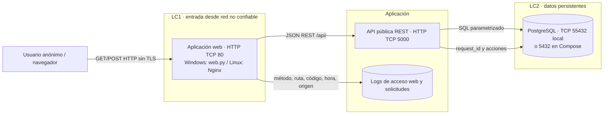

# Lab 3 — Automatización de incidentes de CrowdStrike Falcon

**Estudiantes:**

- Juan Sebastian Murcia Yanquen.
- Sara Viviana Arteaga Rodriguez.

**Opción 1 · Entrega local**

Prototipo académico con la arquitectura solicitada:

**Usuario anónimo → HTTP → Aplicación web → REST → API pública → PostgreSQL.**

Solo utiliza alertas ficticias. No se conecta a CrowdStrike ni necesita tokens Falcon.
La API es pública en el sentido de que no exige autenticación; en esta entrega está
disponible únicamente en el equipo local, no en Internet.

## Abrir y ejecutar en Windows

Requisito: Python 3.12 o superior y conexión a Internet para la primera instalación.
En este equipo también puedes hacer doble clic en **INICIAR.cmd**: detecta el Python
incluido con Codex. Si no existe, utiliza el lanzador `py` de una instalación de Python.
Descarga el repositorio, abre una terminal en su carpeta y ejecuta:

```powershell
python iniciar.py
```

El iniciador crea un entorno virtual, instala tres dependencias, prepara PostgreSQL
17.10 para Windows y arranca ambos servicios. No instala un servicio global de Windows.

- Aplicación: http://127.0.0.1/ (HTTP, puerto 80).
- API directa: http://127.0.0.1:5000/api/alertas.
- PostgreSQL: 127.0.0.1:55432, con contraseña local aleatoria.

Mantén la terminal abierta; Ctrl+C detiene los servicios y conserva la base de datos.
Si el puerto 80 está ocupado, usa `$env:WEB_PORT='8080'` antes de iniciar y abre
http://127.0.0.1:8080. No elimines `.runtime/pgdata` si deseas conservar tus datos.
`.runtime/` contiene credenciales y archivos locales: está excluida de Git y del ZIP.

## Demostración de cinco minutos

1. Pulsa **Completar ejemplo** y después **Registrar alerta**.
2. Verifica que la alerta aparece en la bandeja y que tiene un ID.
3. Selecciónala y añade una nota con **Añadir contexto ficticio**.
4. Cambia su severidad, escálala de forma simulada y consulta el historial.
5. Reinicia con `python iniciar.py`: la alerta y sus acciones continúan en PostgreSQL.

El escalamiento solo cambia el estado; no envía correos, tickets ni acciones a terceros.
El enriquecimiento es una nota manual. La clasificación cambia la severidad seleccionada;
no existe un motor de IA ni una integración SOAR real.

## Qué entregar

- [Informe: requisitos, DFD, riesgos y controles](ENTREGA.md).
- [Diagrama de flujo de datos](diagrams/dfd-lab3.png).
- [Matriz de riesgos](risk-register.md).
- [Evidencia de 23 comprobaciones locales reales](evidencia-local.json).
- Código de aplicación web, API, SQL y procedimiento de reproducción en este repositorio.

La versión inicial solo guardaba alertas en memoria. La versión actual incorpora interfaz
web y PostgreSQL real, conforme a la arquitectura indicada posteriormente por el docente.

## Archivos principales

| Archivo | Función |
|---|---|
| `index.html`, `styles.css`, `web.js`, `public-inventory.txt` | Interfaz web, REST e inventario ficticio de prueba HTTP |
| `web.py` | Servidor HTTP local y proxy hacia la API |
| `app.py` | API REST con Flask y consultas SQL parametrizadas |
| `schema.sql` | Tablas alertas, acciones y solicitudes |
| `iniciar.py` | Inicio automático en Windows |
| `INICIAR.cmd` | Acceso por doble clic en Windows |
| `requirements.txt` | Dependencias fijadas |
| `verificar.py`, `deteccion.sql` | Pruebas locales y detección defensiva |
| `compose.yaml`, `Dockerfile`, `nginx/nginx.conf` | Alternativa Docker/Nginx para reproducir después |

## API REST

| Método y ruta | Resultado |
|---|---|
| GET `/api/health` | Comprueba conexión real con PostgreSQL |
| GET `/api/alertas` | Lista hasta 200 alertas, opcional `?severidad=alta` |
| POST `/api/alertas` | Recibe una alerta ficticia y registra la acción |
| GET `/api/alertas/{id}` | Detalle e historial |
| POST `/api/alertas/{id}/acciones` | clasificar, enriquecer, escalar o cerrar |
| GET `/api/acciones` | Últimas 200 acciones |

Ejemplo PowerShell, sin autenticación:

```powershell
Invoke-RestMethod -Method Post -Uri http://127.0.0.1/api/alertas -ContentType 'application/json; charset=utf-8' -InFile alerta-ejemplo.json
Invoke-RestMethod http://127.0.0.1/api/alertas
```

## Verificación

Con el sistema encendido, en otra terminal:

```powershell
.\.venv\Scripts\python.exe verificar.py
```

La prueba crea una alerta ficticia, registra acciones, provoca cinco 404 locales y
levanta temporalmente una segunda API en 5001 para comprobar el antes/después y la
persistencia al reiniciarla. Actualiza `evidencia-local.json`. No ejecutarla contra terceros.
Las evidencias suministradas corresponden a comprobaciones automatizadas de Codex; no
se atribuyen al estudiante ni sustituyen su demostración propia.

## Alternativa Docker (no ejecutada en este equipo)

Requiere Docker y Compose. Copia `.env.example` a `.env`, define una contraseña larga
alfanumérica local y ejecuta `docker compose up --build`. La web queda en localhost:80,
la API en localhost:5000 y PostgreSQL solo en la red de contenedores. No uses
`docker compose down -v` si necesitas conservar el volumen. La imagen oficial crea el
usuario de inicialización con privilegios elevados; antes de un despliegue real debe
separarse el usuario administrador del usuario de la API. El inicio Windows ya los separa.

## Alcance de la entrega

Se entrega el prototipo local funcional, el despliegue con Nginx en un entorno Linux
(GitHub Codespaces, usado como reemplazo de la instancia Ubuntu asignada por el
docente, no disponible al momento de esta entrega) y el análisis de requisitos, DFD,
riesgos y controles. No se afirma que se completó la ronda entre equipos del
laboratorio de tres horas. Nmap, ZAP, PCAP, firewall de una instancia y retest Nginx
quedan pendientes del entorno autorizado por el docente. HTTPS e identidad se reservan
para Lab 4. No se crea la etiqueta final `lab-3` como si esas actividades ya estuvieran
realizadas.

## Referencias

- Guía docente Laboratorio_3_HTTP_Red_Blue_Team.pdf y arquitectura facilitada en las fotos.
- [CrowdStrike Alerts](https://developer.crowdstrike.com/api-reference/collections/alerts/#postaggregatesalertsv1): referencia conceptual, no contrato implementado. El endpoint enlazado corresponde a agregaciones.
- [Flask](https://flask.palletsprojects.com/en/stable/), [Psycopg](https://www.psycopg.org/psycopg3/docs/) y [PostgreSQL](https://www.postgresql.org/docs/17/).
- [Distribución portable PostgreSQL utilizada por el iniciador](https://github.com/leinelissen/embedded-postgres): versión fijada y checksum SHA-512 comprobado contra el registro.

## Informe de la primera entrega

### 1. Portada y equipo

**Secure Product Challenge · FDSI · Laboratorio 03 · Opción 1.** Proyecto:
automatización de incidentes con alertas *ficticias* inspiradas en CrowdStrike Falcon.
Integrantes: Juan Sebstian Murcia Yanquen y Sara Viviana Arteaga Rodriguez.
Fecha de esta revisión: **23 de septiembre de 2026**. Modalidad comprobada:
Windows local y despliegue Linux en GitHub Codespaces. El repositorio público es
[JuanMurciay/Lab-03-FDSI](https://github.com/JuanMurciay/Lab-03-FDSI).

### 2. Descripción del proyecto (síntesis de una página)

**Problema.** Recibir, clasificar, enriquecer y escalar alertas con pasos manuales
retrasa la respuesta y puede producir prioridades inconsistentes.

**Objetivo de la primera versión.** Registrar alertas de prueba, consultarlas por
REST, cambiar su severidad o estado y conservar un historial de acciones en
PostgreSQL. La interfaz permite demostrar el ciclo sin conocimientos de SQL.

**Usuarios previstos.** En este laboratorio, cualquier usuario del segmento
autorizado entra anónimamente. En un producto posterior habría analistas y
administradores identificados, pero esa identidad pertenece al Laboratorio 4.

**Datos.** Se usan títulos, equipos y notas inventados, como `EQUIPO-LAB-01`.
No se envían alertas reales ni se consultan sistemas de CrowdStrike.

**Alcance y exclusiones.** La versión comprobada funciona en un solo PC Windows
por HTTP, sin autenticación, y adicionalmente se publicó el sitio estático con
Nginx en un entorno Linux (Codespaces). Clasificación y escalamiento son cambios
manuales de estado; no crean tickets ni envían mensajes. No hay despliegue en una
instancia con IP pública asignada por el docente, captura de terceros, HTTPS ni
conexión con Falcon.

**Resultado esperado del despliegue.** Nginx publica el sitio estático por
HTTP/puerto 80. Esto ya se comprobó en un entorno Linux (GitHub Codespaces), usado
como reemplazo de la instancia Ubuntu asignada por el docente, que no estuvo
disponible durante esta entrega. La URL pública temporal comprobada es
`https://didactic-doodle-4j49464rwpwqc7qx4-80.app.github.dev` (cambia cada vez que
se crea un nuevo Codespace). En paralelo, la demostración funcional completa
(interfaz + API + PostgreSQL) se comprobó en `http://127.0.0.1/` en Windows.

### 3. Arquitectura implementada




**Activos:** alertas ficticias, notas, historial, registros de solicitud y
configuración del servidor. **Actores:** usuario anónimo, proceso web, API,
operador Blue Team y Red Team autorizado. LC1 separa la red de la web; LC2
separa solicitudes públicas de los datos persistentes. La superficie de ataque
incluye `/`, archivos estáticos y rutas `/api/…`; el puerto 5000 se liga a
loopback en local. En Windows la web escribe accesos en `.runtime/web.py.log`
y la API guarda solicitudes en PostgreSQL. En el despliegue Linux con Nginx
(Codespaces) se generan `access.log` y `error.log`, tal como se documenta en
la sección 6. La configuración versionada está en [nginx/nginx.conf](nginx/nginx.conf).

### 4. Estructura, requisitos y reproducción

El código ejecutable permanece en la raíz para que `INICIAR.cmd` funcione por
doble clic. `app/` documenta la API; `nginx/` contiene el virtual host;
`diagrams/` contiene el DFD; `evidence/` separa pruebas locales, Red, Blue y
retest; `reports/zap-passive/` queda reservado para el reporte real. La lista
de archivos versionados se obtiene con `git ls-files`; en Linux puede usarse
`find . -maxdepth 3 -type f`, **excluyendo `.runtime`, `.venv` y `.git`**.

Requisitos comprobados: Windows, Python 3.12+, conexión solo para la primera
instalación y puertos locales 80, 5000 y 55432 disponibles. Para el despliegue
con Nginx solo se necesita Ubuntu (o cualquier Linux con `apt`) y permisos de
sudo; se comprobó en GitHub Codespaces siguiendo
[el procedimiento de despliegue y recolección](docs/despliegue-ubuntu.md), en
su parte de instalación de Nginx y publicación del sitio estático (sin la
parte de PostgreSQL/API, reservada para cuando exista una instancia asignada
por el docente con IP y CIDR fijos). Las limitaciones conocidas son HTTP sin
cifrado, acceso anónimo, atribución débil, ausencia de cuotas y el usuario
inicializador de PostgreSQL en Compose.

### 5. Evidencias de ejecución local

[Registro verificable del 23-09-2026](evidence/local/verificacion-2026-09-23.md).
Incluye hora UTC, origen `127.0.0.1`, destino, responsable de la ejecución,
clonación real de GitHub, `git status`, últimos cinco commits, archivos
versionados, presencia de `index.html`, `curl -I` y `curl -i`, estado HTTP
de la web, la API y la página estática. El [extracto local anonimizado](evidence/local/accesos-anonimizados.md)
correlaciona cuatro solicitudes con hora, ruta, status y bytes. La revisión previa comprobó HTTP 200
en `http://127.0.0.1:8080/` y `http://127.0.0.1/`.
La interfaz también se comprobó visualmente en el navegador local durante
esta sesión.

Para repetir la comprobación estática sin publicar credenciales, copie **solo**
`index.html`, `styles.css`, `web.js` y `public-inventory.txt` a una carpeta vacía, abra allí
`python3 -m http.server 8080 --bind 127.0.0.1` (en Windows, `python -m ...`)
y ejecute `curl -I http://localhost:8080` y
`curl http://localhost:8080`. Esa vista estática no puede consultar la API:
la demostración funcional usa `python iniciar.py` y el puerto 80. **No
ejecute `http.server` en la raíz del repositorio si existe `.runtime/`: podría
servir archivos locales de configuración.**

### 6. Evidencias del servidor y Nginx

El repositorio se clonó automáticamente al abrir un **GitHub Codespace**
(entorno Linux en la nube, Ubuntu 24.04.5 LTS), usado como reemplazo de la
instancia Ubuntu asignada por el docente, que no estuvo disponible durante
esta entrega. Todas las evidencias siguientes se tomaron en ese entorno.

**Sistema y fecha (línea base):**

```
$ uname -a
Linux codespaces-c3e5b7 6.8.0-1064-azure #72~22.04.1-Ubuntu SMP ... x86_64 GNU/Linux
$ cat /etc/os-release
PRETTY_NAME="Ubuntu 24.04.5 LTS"
$ date -u +%Y-%m-%dT%H:%M:%SZ
2026-09-23T15:38:08Z
```

**Instalación y arranque de Nginx:**

```
$ sudo apt install -y nginx
[... instalación exitosa de nginx 1.24.0-2ubuntu7.18 ...]
$ sudo service nginx start
 * Starting nginx nginx    [ OK ]
$ sudo service nginx status
 * nginx is running
$ sudo ss -lntp | grep ':80'
LISTEN 0  511  0.0.0.0:80  0.0.0.0:*  users:(("nginx",...))
LISTEN 0  511     [::]:80     [::]:*  users:(("nginx",...))
```

**Publicación del sitio y permisos aplicados:**

```
$ sudo mkdir -p /var/www/muvautomation
$ sudo cp index.html styles.css web.js public-inventory.txt /var/www/muvautomation/
$ sudo chown -R root:www-data /var/www/muvautomation
$ sudo chmod 755 /var/www/muvautomation
$ sudo chmod 644 /var/www/muvautomation/{index.html,styles.css,web.js,public-inventory.txt}
$ sudo cp nginx/muvautomation-baseline.conf /etc/nginx/sites-available/muvautomation
$ sudo ln -s /etc/nginx/sites-available/muvautomation /etc/nginx/sites-enabled/muvautomation
$ sudo rm -f /etc/nginx/sites-enabled/default
$ sudo nginx -t
nginx: configuration file /etc/nginx/nginx.conf test is successful
$ sudo service nginx reload
 * Reloading nginx configuration nginx    [ OK ]
```

**Permisos verificados:**

```
$ stat -c '%a %U:%G %n' /var/www/muvautomation
755 root:www-data /var/www/muvautomation
$ stat -c '%a %U:%G %n' /var/www/muvautomation/*
644 root:www-data /var/www/muvautomation/index.html
644 root:www-data /var/www/muvautomation/styles.css
644 root:www-data /var/www/muvautomation/web.js
644 root:www-data /var/www/muvautomation/public-inventory.txt
```

**Prueba local y código HTTP obtenido:**

```
$ curl -i http://127.0.0.1/
HTTP/1.1 200 OK
Server: nginx/1.24.0 (Ubuntu)
Date: Wed, 23 Sep 2026 15:44:51 GMT
Content-Type: text/html
Content-Length: 3985
```

**URL pública y captura de navegador:** el puerto 80 se reenvió (forward)
desde el panel "Ports" de Codespaces, visible como público, y quedó accesible
en `https://didactic-doodle-4j49464rwpwqc7qx4-80.app.github.dev`, donde se
comprobó visualmente la página "Falcon Lab" cargando correctamente.

**Extractos de `access.log` y `error.log`:**

```
127.0.0.1 - - [23/Sep/2026:15:43:23 +0000] "GET / HTTP/1.1" 200 3985 "-" "curl/8.5.0"
127.0.0.1 - - [23/Sep/2026:15:45:42 +0000] "GET / HTTP/1.1" 200 1689 "https://github.com/" "Mozilla/5.0 ..."
127.0.0.1 - - [23/Sep/2026:15:45:42 +0000] "GET /styles.css HTTP/1.1" 200 3720 "..." "Mozilla/5.0 ..."
127.0.0.1 - - [23/Sep/2026:15:45:42 +0000] "GET /web.js HTTP/1.1" 200 4247 "..." "Mozilla/5.0 ..."
127.0.0.1 - - [23/Sep/2026:15:45:42 +0000] "GET /api/health HTTP/1.1" 502 568 "..." "Mozilla/5.0 ..."
127.0.0.1 - - [23/Sep/2026:15:45:42 +0000] "GET /favicon.ico HTTP/1.1" 404 196 "..." "Mozilla/5.0 ..."

error.log:
2026/09/23 15:45:42 [error] 7739#7739: *6 connect() failed (111: Connection refused)
while connecting to upstream, ... request: "GET /api/health HTTP/1.1",
upstream: "http://127.0.0.1:5000/api/health"
```

El 502 y el error de conexión rechazada son esperados: la API en Python
(puerto 5000) no está activa en este entorno de Codespaces, solo Nginx
sirviendo los archivos estáticos. **Pendiente todavía:** la instancia Ubuntu
con IP/CIDR asignados por el docente, la parte de PostgreSQL/API en Linux, y
las pruebas Nmap/ZAP/PCAP contra esa instancia (ver secciones 5-D de la guía
docente), que solo pueden ejecutarse dentro del alcance autorizado.

### 7. Diagnóstico de fallos

| Comprobación | Esperado | Estado observado / cómo diagnosticar |
|---|---|---|
| `curl http://127.0.0.1/` (Windows) | HTTP 200 | Comprobado. Si hay `connection refused`, revisar `python iniciar.py` y puertos. |
| `curl http://127.0.0.1:8080/` (Windows) | HTTP 200 | Comprobado con los archivos estáticos en carpeta aislada. |
| Arranque PostgreSQL tras cierre brusco | Base lista | El 23-09-2026 tardó ~60 s en recuperar; el iniciador agotaba ~30 s. Se amplió la espera a ~180 s y se comprobó arranque. |
| `sudo nginx -t` (Codespaces) | Sintaxis OK | **Comprobado:** "configuration file test is successful". |
| `curl -i http://127.0.0.1/` (Codespaces) | HTTP 200 | **Comprobado.** |
| Reenvío del puerto 80 (Codespaces) | Puerto disponible | Primer intento: "Unable to forward localhost:80". Se resolvió verificando que Nginx seguía activo y reintentando desde el panel Ports. |
| Acceso desde el CIDR autorizado (instancia del docente) | Página visible | Sin IP/CIDR asignado todavía; si hay timeout, verificar escucha TCP/80, UFW y reglas del proveedor cuando exista la instancia. |
| CSS en el servidor (Codespaces) | HTTP 200 | **Comprobado** en `access.log` (`GET /styles.css` → 200). |

### 8. Modelo de amenazas inicial (STRIDE)

| Categoría | Riesgo o hipótesis | Evidencia/prueba | Mitigación |
|---|---|---|---|
| **S**poofing | No se puede distinguir a dos personas anónimas; cualquiera puede enviar una alerta diciendo ser otro. | `actor=anonimo` en historial; el sitio no pide usuario ni contraseña. | Identidad y sesiones en Lab 4. |
| **T**ampering | Cualquiera en alcance puede cambiar la prioridad/estado. HTTP permite alteración en tránsito porque no está cifrado. | POST anónimo local comprobado; `curl -i` muestra `http://`, no `https://`. | Validación y SQL parametrizado aplicados; roles y TLS en Lab 4. |
| **R**epudiation | Un usuario puede negar una acción porque IP/hora no prueban identidad. | `request_id` correlacionado localmente; `access.log` de Nginx solo guarda IP y hora, no un usuario. | Logs protegidos, reloj sincronizado e identidad en Lab 4. |
| **I**nformation Disclosure | HTTP deja ver rutas y contenido; el servidor revela su versión exacta. | `curl -i` muestra `Server: nginx/1.24.0 (Ubuntu)`; PCAP y ZAP pendientes de instancia autorizada. | Minimizar datos ahora; `server_tokens off;` y TLS en Lab 4. |
| **D**enial of Service | Peticiones repetidas pueden consumir API/BD o saturar rutas inexistentes. | Límite de cuerpo 8192 bytes comprobado; `GET /favicon.ico` devolvió 404 sin límite de intentos. | Cuotas, retención, `rate limiting` en Nginx y capacidad antes de exposición real. |
| **E**levation of Privilege | El mismo acceso anónimo puede ejecutar cambios reservados a un analista; rutas ocultas como `.git/config` no están bloqueadas todavía. | `POST /api/alertas/{id}/acciones` anónimo comprobado; regla de bloqueo de rutas ocultas aún no aplicada en `muvautomation-baseline.conf`. | Definir roles y autorización en Lab 4; aplicar `location ~ /\. { deny all; }` en el hardening. |

La [matriz](risk-register.md) detalla probabilidad, impacto y estado. Una
hipótesis pendiente no equivale a explotación. **Solo la IP/URL y ventana que
asigne el docente pueden usarse para Nmap, ZAP o captura de tráfico.**

Se redujo el [inventario público ficticio](public-inventory.txt) a tres
identificadores sin funciones, IP ni nombres reales. La versión anterior se
conserva en el commit `6abaf20` para comparar el contenido antes/después.

### 9. Conclusión

La primera versión funciona localmente con interfaz HTTP, API REST y
PostgreSQL en Windows; los datos y acciones persisten y las pruebas locales
son reproducibles. Adicionalmente, se logró desplegar y comprobar Nginx
sirviendo el sitio estático en un entorno Linux (GitHub Codespaces), con
evidencia real de instalación, configuración, permisos, logs y acceso desde
navegador por una URL pública temporal. El ciclo completo de la guía del
docente todavía requiere la instancia Ubuntu con IP/CIDR asignados, una ronda
Red/Blue autorizada, PCAP filtrado, reporte ZAP pasivo, retest remoto,
reflexión personal y la etiqueta final `lab-3`. La
[matriz de cumplimiento](docs/cumplimiento-lab3.md) permite cerrar cada punto
con evidencia real durante la sesión con el docente.