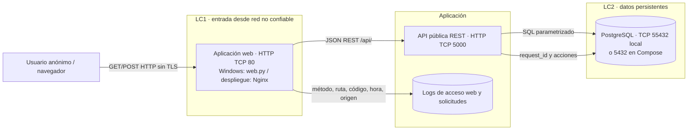

# Lab 3 — Automatización de incidentes de CrowdStrike Falcon

**Estudiantes:**

- Juan Sebstian Murcia Yanquen.
- Sara Viviana Arteaga Rodriguez.

**Opción 1 · Entrega local**

Prototipo académico con la arquitectura solicitada:

**Usuario anónimo → HTTP → Aplicación web → REST → API pública → PostgreSQL.**

Solo utiliza alertas ficticias. No se conecta a CrowdStrike ni necesita tokens Falcon.
La API es pública en el sentido de que no exige autenticación; en esta entrega está
disponible únicamente en el equipo local, no en Internet.

## Abrir y ejecutar en Windows

Requisito: Python 3.12 o superior y conexión a Internet para la primera instalación.
En este equipo también puedes hacer doble clic en **INICIAR.cmd**: detecta el Python
incluido con Codex. Si no existe, utiliza el lanzador `py` de una instalación de Python.
Descarga el repositorio, abre una terminal en su carpeta y ejecuta:

```powershell
python iniciar.py
```

El iniciador crea un entorno virtual, instala tres dependencias, prepara PostgreSQL
17.10 para Windows y arranca ambos servicios. No instala un servicio global de Windows.

- Aplicación: http://127.0.0.1/ (HTTP, puerto 80).
- API directa: http://127.0.0.1:5000/api/alertas.
- PostgreSQL: 127.0.0.1:55432, con contraseña local aleatoria.

Mantén la terminal abierta; Ctrl+C detiene los servicios y conserva la base de datos.
Si el puerto 80 está ocupado, usa `$env:WEB_PORT='8080'` antes de iniciar y abre
http://127.0.0.1:8080. No elimines `.runtime/pgdata` si deseas conservar tus datos.
`.runtime/` contiene credenciales y archivos locales: está excluida de Git y del ZIP.

## Demostración de cinco minutos

1. Pulsa **Completar ejemplo** y después **Registrar alerta**.
2. Verifica que la alerta aparece en la bandeja y que tiene un ID.
3. Selecciónala y añade una nota con **Añadir contexto ficticio**.
4. Cambia su severidad, escálala de forma simulada y consulta el historial.
5. Reinicia con `python iniciar.py`: la alerta y sus acciones continúan en PostgreSQL.

El escalamiento solo cambia el estado; no envía correos, tickets ni acciones a terceros.
El enriquecimiento es una nota manual. La clasificación cambia la severidad seleccionada;
no existe un motor de IA ni una integración SOAR real.

## Qué entregar

- [Informe: requisitos, DFD, riesgos y controles](ENTREGA.md).
- [Diagrama de flujo de datos](diagrams/dfd-lab3.png).
- [Matriz de riesgos](risk-register.md).
- [Evidencia de 23 comprobaciones locales reales](evidencia-local.json).
- Código de aplicación web, API, SQL y procedimiento de reproducción en este repositorio.

La versión inicial solo guardaba alertas en memoria. La versión actual incorpora interfaz
web y PostgreSQL real, conforme a la arquitectura indicada posteriormente por el docente.

## Archivos principales

| Archivo | Función |
|---|---|
| `index.html`, `styles.css`, `web.js`, `public-inventory.txt` | Interfaz web, REST e inventario ficticio de prueba HTTP |
| `web.py` | Servidor HTTP local y proxy hacia la API |
| `app.py` | API REST con Flask y consultas SQL parametrizadas |
| `schema.sql` | Tablas alertas, acciones y solicitudes |
| `iniciar.py` | Inicio automático en Windows |
| `INICIAR.cmd` | Acceso por doble clic en Windows |
| `requirements.txt` | Dependencias fijadas |
| `verificar.py`, `deteccion.sql` | Pruebas locales y detección defensiva |
| `compose.yaml`, `Dockerfile`, `nginx/nginx.conf` | Alternativa Docker/Nginx para reproducir después |

## API REST

| Método y ruta | Resultado |
|---|---|
| GET `/api/health` | Comprueba conexión real con PostgreSQL |
| GET `/api/alertas` | Lista hasta 200 alertas, opcional `?severidad=alta` |
| POST `/api/alertas` | Recibe una alerta ficticia y registra la acción |
| GET `/api/alertas/{id}` | Detalle e historial |
| POST `/api/alertas/{id}/acciones` | clasificar, enriquecer, escalar o cerrar |
| GET `/api/acciones` | Últimas 200 acciones |

Ejemplo PowerShell, sin autenticación:

```powershell
Invoke-RestMethod -Method Post -Uri http://127.0.0.1/api/alertas -ContentType 'application/json; charset=utf-8' -InFile alerta-ejemplo.json
Invoke-RestMethod http://127.0.0.1/api/alertas
```

## Verificación

Con el sistema encendido, en otra terminal:

```powershell
.\.venv\Scripts\python.exe verificar.py
```

La prueba crea una alerta ficticia, registra acciones, provoca cinco 404 locales y
levanta temporalmente una segunda API en 5001 para comprobar el antes/después y la
persistencia al reiniciarla. Actualiza `evidencia-local.json`. No ejecutarla contra terceros.
Las evidencias suministradas corresponden a comprobaciones automatizadas de Codex; no
se atribuyen al estudiante ni sustituyen su demostración propia.

## Alternativa Docker (no ejecutada en este equipo)

Requiere Docker y Compose. Copia `.env.example` a `.env`, define una contraseña larga
alfanumérica local y ejecuta `docker compose up --build`. La web queda en localhost:80,
la API en localhost:5000 y PostgreSQL solo en la red de contenedores. No uses
`docker compose down -v` si necesitas conservar el volumen. La imagen oficial crea el
usuario de inicialización con privilegios elevados; antes de un despliegue real debe
separarse el usuario administrador del usuario de la API. El inicio Windows ya los separa.

## Alcance de la entrega

Se entrega el prototipo local funcional y el análisis de requisitos, DFD, riesgos y
controles. No se afirma que se completó la ronda entre equipos del laboratorio de tres
horas. Nmap, ZAP, PCAP, firewall de una instancia y retest Nginx quedan pendientes del
entorno autorizado. HTTPS e identidad se reservan para Lab 4. No se crea la etiqueta
final `lab-3` como si esas actividades ya estuvieran realizadas.


## Referencias

- Guía docente Laboratorio_3_HTTP_Red_Blue_Team.pdf y arquitectura facilitada en las fotos.
- [CrowdStrike Alerts](https://developer.crowdstrike.com/api-reference/collections/alerts/#postaggregatesalertsv1): referencia conceptual, no contrato implementado. El endpoint enlazado corresponde a agregaciones.
- [Flask](https://flask.palletsprojects.com/en/stable/), [Psycopg](https://www.psycopg.org/psycopg3/docs/) y [PostgreSQL](https://www.postgresql.org/docs/17/).
- [Distribución portable PostgreSQL utilizada por el iniciador](https://github.com/leinelissen/embedded-postgres): versión fijada y checksum SHA-512 comprobado contra el registro.

## Informe de la primera entrega

### 1. Portada y equipo

**Secure Product Challenge · FDSI · Laboratorio 03 · Opción 1.** Proyecto:
automatización de incidentes con alertas *ficticias* inspiradas en CrowdStrike Falcon.
Integrantes: Juan Sebstian Murcia Yanquen y Sara Viviana Arteaga Rodriguez.
Fecha de esta revisión: **23 de septiembre de 2026**. Modalidad comprobada:
Windows local. El repositorio público es
[JuanMurciay/Lab-03-FDSI](https://github.com/JuanMurciay/Lab-03-FDSI).

### 2. Descripción del proyecto (síntesis de una página)

**Problema.** Recibir, clasificar, enriquecer y escalar alertas con pasos manuales
retrasa la respuesta y puede producir prioridades inconsistentes.

**Objetivo de la primera versión.** Registrar alertas de prueba, consultarlas por
REST, cambiar su severidad o estado y conservar un historial de acciones en
PostgreSQL. La interfaz permite demostrar el ciclo sin conocimientos de SQL.

**Usuarios previstos.** En este laboratorio, cualquier usuario del segmento
autorizado entra anónimamente. En un producto posterior habría analistas y
administradores identificados, pero esa identidad pertenece al Laboratorio 4.

**Datos.** Se usan títulos, equipos y notas inventados, como `EQUIPO-LAB-01`.
No se envían alertas reales ni se consultan sistemas de CrowdStrike.

**Alcance y exclusiones.** La versión comprobada funciona en un solo PC Windows
por HTTP, sin autenticación. Clasificación y escalamiento son cambios manuales
de estado; no crean tickets ni envían mensajes. No hay despliegue de Internet,
captura de terceros, HTTPS ni conexión con Falcon.

**Resultado esperado del despliegue.** En una instancia Ubuntu que asigne el
docente, Nginx debe publicar el sitio por HTTP/80 solo al CIDR autorizado,
enviar `/api/` al proceso API y conservar los datos en PostgreSQL. **Ese
despliegue todavía no tiene URL/IP asignada ni evidencia de ejecución.** La
URL comprobada hoy es `http://127.0.0.1/`, accesible solo desde este equipo.

### 3. Arquitectura implementada




**Activos:** alertas ficticias, notas, historial, registros de solicitud y
configuración del servidor. **Actores:** usuario anónimo, proceso web, API,
operador Blue Team y Red Team autorizado. LC1 separa la red de la web; LC2
separa solicitudes públicas de los datos persistentes. La superficie de ataque
incluye `/`, archivos estáticos y rutas `/api/…`; el puerto 5000 se liga a
loopback en local. En Windows la web escribe accesos en `.runtime/web.py.log`
y la API guarda solicitudes en PostgreSQL. En Ubuntu, Nginx escribe
`/var/log/nginx/access.log` y `/var/log/nginx/error.log`; la configuración
versionada está en [nginx/nginx.conf](nginx/nginx.conf).

### 4. Estructura, requisitos y reproducción

El código ejecutable permanece en la raíz para que `INICIAR.cmd` funcione por
doble clic. `app/` documenta la API; `nginx/` contiene el virtual host;
`diagrams/` contiene el DFD; `evidence/` separa pruebas locales, Red, Blue y
retest; `reports/zap-passive/` queda reservado para el reporte real. La lista
de archivos versionados se obtiene con `git ls-files`; en Linux puede usarse
`find . -maxdepth 3 -type f`, **excluyendo `.runtime`, `.venv` y `.git`**.

Requisitos comprobados: Windows, Python 3.12+, conexión solo para la primera
instalación y puertos locales 80, 5000 y 55432 disponibles. La ejecución local
y alternativa Compose están explicadas arriba. Para una instancia Ubuntu
autorizada, siga [el procedimiento de despliegue y recolección](docs/despliegue-ubuntu.md)
después de que el docente entregue IP, CIDR y ventana. La URL pública de la
aplicación queda **pendiente de asignación**; el enlace GitHub publica código,
no la aplicación. Las limitaciones conocidas son HTTP sin cifrado, acceso
anónimo, atribución débil, ausencia de cuotas y el usuario inicializador de
PostgreSQL en Compose.

### 5. Evidencias de ejecución local

[Registro verificable del 23-09-2026](evidence/local/verificacion-2026-09-23.md).
Incluye hora UTC, origen `127.0.0.1`, destino, responsable de la ejecución,
clonación real de GitHub, `git status`, últimos cinco commits, archivos
versionados, presencia de `index.html`, `curl -I` y `curl -i`, estado HTTP
de la web, la API y la página estática. El [extracto local anonimizado](evidence/local/accesos-anonimizados.md)
correlaciona cuatro solicitudes con hora, ruta, status y bytes. La revisión previa comprobó HTTP 200
en `http://127.0.0.1:8080/` y `http://127.0.0.1/`.
La interfaz también se comprobó visualmente en el navegador local durante
esta sesión; para la entrega académica todavía hay que adjuntar una captura
de pantalla exportada con fecha y URL visibles.

Para repetir la comprobación estática sin publicar credenciales, copie **solo**
`index.html`, `styles.css`, `web.js` y `public-inventory.txt` a una carpeta vacía, abra allí
`python3 -m http.server 8080 --bind 127.0.0.1` (en Windows, `python -m ...`)
y ejecute `curl -I http://localhost:8080` y
`curl http://localhost:8080`. Esa vista estática no puede consultar la API:
la demostración funcional usa `python iniciar.py` y el puerto 80. **No
ejecute `http.server` en la raíz del repositorio si existe `.runtime/`: podría
servir archivos locales de configuración.**

### 6. Evidencias del servidor y Nginx

**Pendiente por falta de instancia Linux asignada.** No se presentan salidas
ficticias de `hostname`, `whoami`, `pwd`, `nginx -v`, `systemctl status nginx`,
`nginx -t` ni `curl -I http://localhost`. Tampoco hay URL/IP pública,
captura de navegador remoto, permisos del directorio publicado ni extractos
reales de `access.log`/`error.log`. El archivo que se instalará es
[nginx/nginx.conf](nginx/nginx.conf). El procedimiento enlazado arriba contiene
los comandos exactos para obtener cada evidencia cuando exista autorización.
En el equipo local se comprobó `Server: LabHTTP`, no un Nginx ejecutándose.

### 7. Diagnóstico de fallos

| Comprobación | Esperado | Estado observado / cómo diagnosticar |
|---|---|---|
| `curl http://127.0.0.1/` | HTTP 200 | Comprobado. Si hay `connection refused`, revisar `python iniciar.py` y puertos. |
| `curl http://127.0.0.1:8080/` | HTTP 200 | Comprobado con los archivos estáticos en carpeta aislada. |
| Arranque PostgreSQL tras cierre brusco | Base lista | El 23-09-2026 tardó ~60 s en recuperar; el iniciador agotaba ~30 s. Se amplió la espera a ~180 s y se comprobó arranque. |
| `sudo nginx -t` en Ubuntu | Sintaxis OK | Sin instancia; ejecutar allí y guardar salida. Un error de línea debe corregirse antes del reload. |
| Acceso desde el CIDR autorizado | Página visible | Sin IP/CIDR; si hay timeout, verificar escucha TCP/80, UFW y reglas del proveedor. |
| CSS en el servidor | HTTP 200 | Si hay 404, revisar ubicación del archivo y rutas en `index.html`. |

### 8. Modelo de amenazas inicial (STRIDE)

| Categoría | Riesgo o hipótesis | Evidencia/prueba | Mitigación |
|---|---|---|---|
| **S**poofing | No se puede distinguir a dos personas anónimas. | `actor=anonimo` en historial; autenticación ausente por diseño. | Identidad y sesiones en Lab 4. |
| **T**ampering | Cualquiera en alcance puede cambiar la prioridad/estado. HTTP permite alteración en tránsito. | POST anónimo local comprobado; no se hizo MITM. | Validación y SQL parametrizado aplicados; roles y TLS en Lab 4. |
| **R**epudiation | Un usuario puede negar una acción porque IP/hora no prueban identidad. | `request_id` y acción correlacionados localmente. | Logs protegidos, reloj sincronizado e identidad en Lab 4. |
| **I**nformation Disclosure | HTTP deja ver rutas y contenido; alertas se consultan sin identidad. | `curl -i` y consultas anónimas; PCAP y ZAP pendientes. | Minimizar datos ahora; TLS y autorización en Lab 4. |
| **D**enial of Service | Peticiones repetidas pueden consumir API/BD. | Límite de cuerpo 8192 bytes comprobado; no se realizó DoS. | Cuotas, retención y capacidad antes de exposición real. |
| **E**levation of Privilege | El mismo acceso anónimo puede ejecutar cambios reservados a un analista. | `POST /api/alertas/{id}/acciones` anónimo comprobado. | Definir roles y autorización en Lab 4. |

La [matriz](risk-register.md) detalla probabilidad, impacto y estado. Una
hipótesis pendiente no equivale a explotación. **Solo la IP/URL y ventana que
asigne el docente pueden usarse para Nmap, ZAP o captura de tráfico.**

Se redujo el [inventario público ficticio](public-inventory.txt) a tres
identificadores sin funciones, IP ni nombres reales. La versión anterior se
conserva en el commit `6abaf20` para comparar el contenido antes/después.

### 9. Conclusión

La primera versión funciona localmente con interfaz HTTP, API REST y
PostgreSQL; los datos y acciones persisten y las pruebas locales son
reproducibles. El ciclo completo del PDF requiere todavía la instancia Ubuntu
asignada, una ronda Red/Blue autorizada, PCAP filtrado, logs Nginx, reporte
ZAP pasivo, retest remoto, reflexión personal y la etiqueta final `lab-3`.
La [matriz de cumplimiento](docs/cumplimiento-lab3.md) permite cerrar cada
punto con evidencia real durante la sesión.
